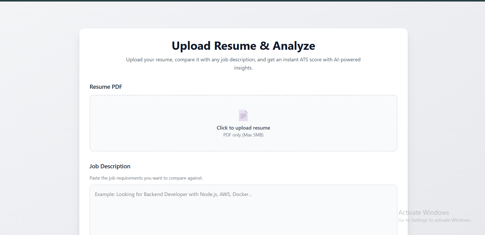

# 🚀 AI-Powered Resume Analyzer

An AI-powered Resume Analyzer that compares a candidate's resume with a job description and generates an ATS compatibility score along with actionable insights using Google's Gemini API.

## 🌐 Live Demo

- **Live Link:** https://ai-resume-analyser-89wz-cxocym8dk-shivcodecfs-projects.vercel.app/


---

## ✨ Features

- 📄 Upload Resume in PDF format
- 🤖 AI-powered ATS Resume Analysis
- 📊 ATS Compatibility Score
- 🔍 Missing Keyword Detection
- 💪 Resume Strength Analysis
- 💡 Personalized Improvement Suggestions
- ⚡ Fast PDF Parsing & Text Extraction
- 🌍 Fully Deployed Application

---

## 🛠 Tech Stack

### Frontend
- Next.js
- TypeScript
- React
- Tailwind CSS

### Backend
- Node.js
- Express.js
- TypeScript
- Multer
- pdf-parse

### AI
- Google Gemini API

### Deployment
- Vercel
- Render

---

## 📂 Project Structure

```
AI-powered-Resume/
│
├── backend/
│   ├── src/
│   │   ├── controllers/
│   │   ├── routes/
│   │   ├── services/
│   │   ├── middleware/
│   │   └── index.ts
│   └── package.json
│
└── frontend/
    └── app/
        ├── src/
        │   ├── app/
        │   ├── components/
        │   ├── services/
        │   └── types/
        └── package.json
```

---

## ⚙️ How It Works

```text
User Uploads Resume (PDF)
            │
            ▼
     PDF Text Extraction
            │
            ▼
Job Description + Resume Text
            │
            ▼
       Gemini API
            │
            ▼
 ATS Score + Missing Keywords
 Strengths + Suggestions
            │
            ▼
      Display Result
```

---

## 📸 Screenshots

### Home Page



<!-- ### Upload Resume


### Analysis Result

 -->

---

## 🚀 Installation

### Clone Repository

```bash
git clone https://github.com/yourusername/AI-powered-Resume.git
```

---

## Backend Setup

```bash
cd backend

npm install

npm run dev
```

Backend runs on:

```
http://localhost:1120
```

---

## Frontend Setup

```bash
cd frontend/app

npm install

npm run dev
```

Frontend runs on:

```
http://localhost:3000
```

---

## 🔑 Environment Variables

### Backend (.env)

```env
GEMINI_API_KEY=YOUR_GEMINI_API_KEY
PORT=1120
```

### Frontend (.env.local)

```env
NEXT_PUBLIC_API_URL=http://localhost:1120
```

For production:

```env
NEXT_PUBLIC_API_URL=https://your-backend.onrender.com
```

---

## 📡 API Endpoint

### Analyze Resume

**POST**

```
/api/analyze-pdf
```

### Form Data

| Key | Type |
|------|------|
| resume | PDF File |
| jobDescription | String |

---

## 📈 Sample Response

```json
{
  "success": true,
  "data": {
    "score": 88,
    "missingKeywords": [
      "Docker",
      "AWS"
    ],
    "strengths": [
      "Strong Backend Development",
      "REST API Design"
    ],
    "suggestions": [
      "Add Docker experience",
      "Highlight CI/CD implementation"
    ]
  }
}
```

---

## 🎯 Future Enhancements

- User Authentication
- Resume History
- Download PDF Report
- AI Resume Rewriting
- Resume Version Comparison
- Job Recommendation Engine
- Multi-language Support
- OpenAI Integration
- Interview Question Generator
- Resume Scoring Dashboard

---

## 📌 Key Highlights

- Built an end-to-end AI-powered SaaS application.
- Implemented PDF upload and parsing pipeline.
- Integrated Gemini API for intelligent resume evaluation.
- Generated ATS score, keyword gap analysis, strengths, and personalized suggestions.
- Developed REST APIs using Node.js, Express.js, and TypeScript.
- Deployed frontend on Vercel and backend on Render.

---

## 👨‍💻 Author

**Shivam Yadav**

- LinkedIn: https://www.linkedin.com/in/shivam-yadav-620a03232/
- GitHub: https://github.com/shivcodecf/Ai-resume_Analyser

---

## ⭐ If you like this project

Give this repository a ⭐ on GitHub!